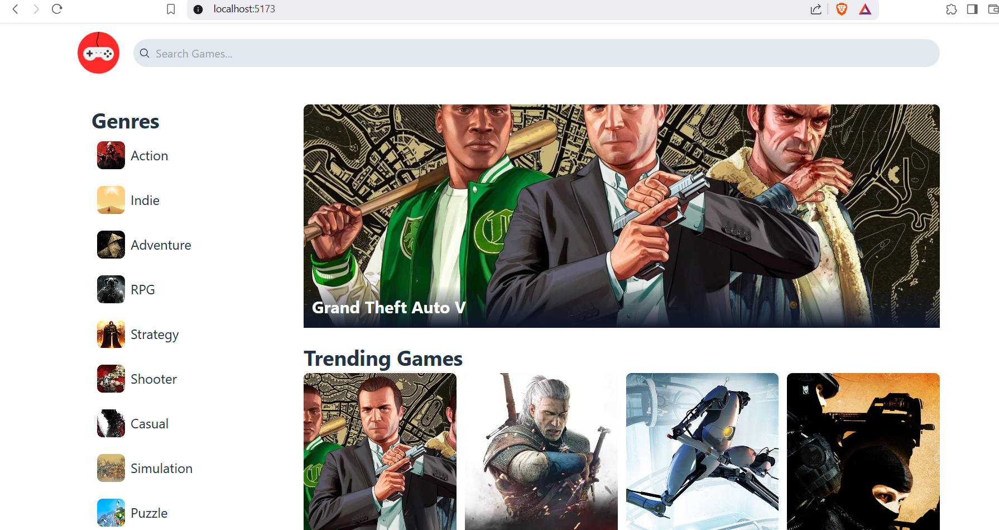

This application is a Game Catalog which displays games accirding to different genres and has a section for trending games. The list of games and genres are coming from an external source using an API call.

This app was primarily built using ReactJS, Tailwind CSS and Vite.

To run the application, navigate to main directory and run:

npm run dev

This will run the ppliaction on localhost on port 5173.

The app looks like this:

